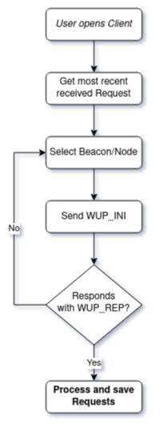
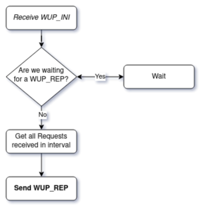
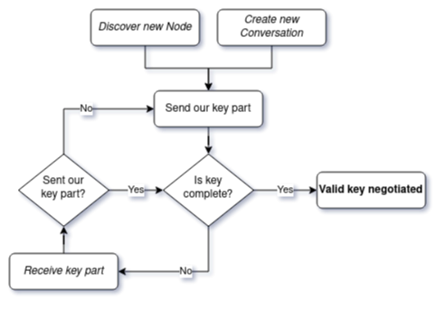
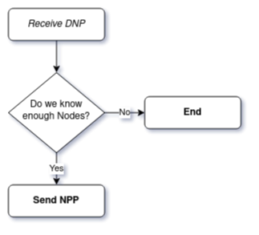
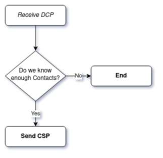
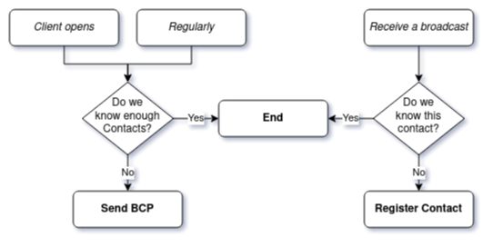

# Introduction

**Sami** is a decentralized communication app.  
It currently allows for textual messages exchange.  
The network created by users is decentralized, meaning no one controls it.

It is mainly inspired from 
[Ethereum Whisper](https://geth.ethereum.org/docs/whisper/how-to-whisper),
the [Scuttlebutt protocol](https://ssbc.github.io/scuttlebutt-protocol-guide/) 
and [Jami](https://www.jami.net).

While the network is very resilient at medium and large scale, 
there can be some unexpected errors and problems at a very small scale (only a 
few users).  
Usually, the larger the network, the better.

# Keys and identities

The first thing a user needs to participate in the Sami network is an identity.  
An identity is referred to as a ``Node`` and is an RSA key pair (a public key 
and a private key).  
It typically represents a person or a bot.  
It is normal for a person to have several identities.

Because identities are long and random, no coordination or permission is 
required to create a new one, which is essential to the network’s design.

A name is generated from the user's public key, giving it a human-readable 
identifier.

If a user loses their secret key or has it stolen, they will need to generate a 
new identity. Keys are ___only___ stored in the user's local files, and 
therefore cannot be recovered by a third-party.

The public key of any ``Node`` is publicly available and transmitted in some 
network protocols, as we'll see later in this document.

## Dark network

Sami adopts a *dark network* architecture.

This means that, by design, a ``Node`` (an identity on the Sami P2P network) 
and a ``Contact`` (an IP address, the user's identity on the Internet) 
cannot be linked.

# Attacks

In this section, we'll have a look at a few common attacks, as well as 
Sami-specific known attacks.

## Sybil attacks

In a Sybil attack, an attacker takes over the network by creating numerous 
identities.  
Here, two situations apply:

### Node takeover

By *node takeover*, we mean that an attacker overloads the P2P network with 
Sami identities.

This simply has no effect on the P2P network.

### Contact takeover

On the other hand, *contact takeover* can be a problem.
This is because while a ``Node`` is a virtual identity, a ``Contact`` is a 
physical identity.

Therefore, in the attacks we'll see further on, we'll talk about 
*contact takeover* and not *node takeover*.

## 51% attacks

A 51% attack refers to an attack on a decentralized network by a 
group of attackers controlling more than 50% of the network's workforce.

This type of attacks is not applicable to the Sami network.

There are two possible ways of seeing the situation:

### Configuration corruption

In this case, a group of attackers modifies their client's configuration to one 
that is insecure.  
This will result in a different network from the usual users' - 
what we call a fork.  
This is due to the fact that Sami clients are very rigid regarding other nodes' 
configuration, and will discard any malformed requests.

### Attackers consensus

If a group of seemingly normal users join a network but are controller by attackers, 
there is next to nothing they will be able to do, unless the network is very small, 
in which case the dark network architecture can be endangered.

To avoid this kind of situation, there is a built-in threshold of contacts one 
must know before starting to send identifying requests.  
However, this preemptive measure will not be enough if 49 out of 50 clients are 
controlled by a bad actor !

A simple measure against this type of attack is simply to have a group of 
legitimate users on the network.  
They don't even need to add up to 50% of the network or more ; for any 
additional user, it becomes exponentially harder to identify each one.

## Flooding attacks

Flooding attacks consist in flooding the network with requests.  
At the moment, no solution is implemented, but is being actively worked on.

The easy way out would be to implement proof-of-work, and while it is very 
efficient pre-quantum, it has terrible effects on power consumption, 
and massively contributes to climate change (cf Bitcoin).

## Deny attacks

A deny attack consists, for an attacker, to not forward any or part of the 
requests he receives.  
It is pretty hard to find out whether a client denies requests, 
and the effects of this attack can be various.

No solution is yet implemented.

However, a simple counter-measure is simply to have a significant part of 
legitimate users on the P2P network.

# Terms

## *Note on formatting*

In the structure definition, the format used is :
- `Type` `value_name` - A quick description of the value

Several times, "timestamps" are mentioned. They are logged as UNIX seconds ;
[more on this subject](https://www.unixtimestamp.com/).

## Client

A ``Client`` is an instance of the Sami software, and an individual on the network.  
One ``Client`` can host multiple ``Nodes`` (identities), while not at the same time.  
It is a relay on the network, and is accessible via its ``Contact`` information.

## Node

### Node

A ``Node`` is person on the network, identified by an RSA public key.

Its structure is defined as:

- `Integer` `rsa_n` - RSA modulus
- `Integer` `rsa_e` - RSA public exponent
- `String` `hash` - Serialized hash of the concatenated `rsa_n` and `rsa_e`
- `String` `sig` - Cryptographic signature of `hash` made by the author

Sending a ``Message`` to a ``Node`` is not instantaneous, 
unlike ``Contacts`` communication.

### Master node

A ``MasterNode`` is our own identity.  
Unlike the ``Node``, we have its RSA private key.

## Contact

You can see a ``Contact`` as a "link" to a ``Client`` on the network.  
It is defined by an address (IP or DNS name) and a port:

- `String` `address` - A DNS name or an IP address
- `Integer` `port` - The port on which the author's `client` is listening

The network design prevents a ``Contact`` information to be linked to 
a ``Node`` information.

If the recipient client is running, a communication with a contact is instantaneous.

## Message

A ``Message`` is... a... message. I know, shocking !

It is encrypted and signed by its author, and sent as part of a ``Conversation``.

A ``Message`` is structured as follows:

- `String` `content` - Actual message, encrypted with the negotiated AES key
- `Integer` `time_sent` - The date of sending
- `String` `digest` - Cryptographic digest of the message's hash
- `String` `author` - The ID of the author ``Node``
- `String` `conversation` - The ID of the ``Conversation`` the ``Message`` is part of

## Conversation

A ``Conversation`` is a set of ``Messages`` distributed to a list of ``Nodes``.  

The ID is deterministically computed based on its members, making it common.

To exchange encrypted messages (and be able to decrypt them), all the members 
must have negotiated a common AES key via the *Keys Exchange Protocol* (*KEP*).

Paranoia note: an attacker could create a rainbow table of all the existing 
``Conversations`` IDs based on the ``Nodes`` he knows, and could figure out the 
members of any ``Conversation`` (given that he knows all the ``Nodes`` part 
of it).

# Discovery

After a user has generated its identity, it needs to find some peers.  
To connect to somebody, you need to know its ``Contact`` information.  
The list of discovered ``Contacts`` will appear in the ``Client``'s user interface.

There a several ways of discovering a ``Contacts``:

## Beacons

A ``Beacon`` is a standard ``Client`` that is assured to run at all time.  
They are hard-coded inside the configuration and managed by the project maintainers.  

While this goes against the decentralized design, it is common practice (e.g., 
Bitcoin), and a good way to discover new ``Contacts`` and ``Nodes`` without 
flooding the network.

## Local network

Once the Sami ``Client`` is opened, and if it doesn't know enough ``Contacts``,
it will broadcast over the network a *Broadcast Contact Protocol* (*BCP*) 
``Request`` containing its own ``Contact`` information, while listening for others.  
It will do so regularly (depending on the local configuration).

When catching a *BCP* ``Request``, the ``Client`` will save the information if it
doesn't know it already.

# Protocols

All ``Requests`` have a common structure:

- `String` `status` - The request type
- `Dictionary` `data` - The content of the `Request`
- `Integer` `timestamp` - The timestamp of the time when the `Request` was built

In the following ``Requests``' definition, we'll be explaining the structure of 
the `data` field.
The `status` is the name of the section. 
E.g., for *Node Publication Protocol - NPP*, `status = NPP`.

In the diagrams:
- Boxes in *italic* designate entry points of the protocol,
  otherwise said, the events that triggers the process
- Boxes in **bold** designate final actions

## What's Up Protocol - "WUP"

This protocol is used to gather all the ``Requests`` we missed while we were 
offline.

### INI

#### Request structure

- `Integer` `beginning` - A timestamp specifying the beginning of the interval
- `Integer` `end` - A timestamp specifying the end of the interval
- `Contact` `author` - Our own ``Contact`` information

### REP

#### Request structure

- `List[Request]` - The list of `Requests` found in the specified interval

## Keys Exchange Protocol - "KEP"

This protocol is used when negotiating a new symmetric encryption key 
(currently Advanced Encryption Standard - *AES*) for a new ``Conversation``.

The protocol is implemented in such a way that all members of a 
``Conversation`` are partly in charge of negotiating a common key.

By default, we launch a *KEP* handshake with each ``Node`` we discover.
It allows the user to be able to speak with every node he knows.

We never send the full key nor nonce over the network.

If the protocol has been respected by all parties, they should have the same 
key and nonce.

### Request structure

- `String` `part` - The key part, encrypted with the target member's 
                     public key
- `String` `hash` - The serialized hash of the encrypted key part
- `String` `sig` - The cryptographic signature of `hash`
- `Node` `author` - The ``Node`` information of the author of this key part
- `List[Node]` `members` - The list of ``Nodes`` member of this conversation

### Technical notes

Thanks to the encrypted key part, we can quickly know if a key part 
is addressed to us.  

#### Key partitioning

If `N / M` doesn't return a round integer - for example `N = 32` 
(the key is 32 bytes long) and `M = 5` (there are 5 members in the 
``Conversation``), `32 / 5 = 6.4` - we follow this process:

1. Let `r` be the remainder: `r = 32 % 5 = 2` and `f` be the floor division 
   result: `f = 32 // 5 = 6`
2. Let `K` be the list of the ``Node`` identifiers
3. Sort `K` in ascending order, concatenate the keys, and hash the result
4. We then get the member identifier which is the closest to this value: he
   is the one designated for creating the key part left. 
5. If we are the designated member, we create a key of length `r + f`
   (`2 + 6 = 8`), otherwise we create a key of length `f`

## Message Propagation Protocol - "MPP".

This protocol is used when sending or retransmitting a ``Message``.  

### Request structure

- `Message` `message` - The ``Message`` to propagate
- `String` `conversation` - The ID of the ``Conversation`` this ``Message`` if part of

## Node Publication Protocol - "NPP"

This protocol is used for sending a ``Node`` identity over the network.

### Request structure

- `List[Node]` - The list of ``Nodes`` we know (including ours).

## Contact Sharing Protocol - "CSP"

This protocol is used when we want to share a ``Contact`` with a peer.

### Request structure

- `List[Contact]` - The list of ``Contacts`` we know.

## Broadcast Contact Protocol - "BCP"

This protocol is used for sharing ``Contact`` information on a local network.

### Request structure

- `Contact` `author` - Our own ``Contact`` information

## Discover Nodes Protocol - "DNP"

Asks a ``Contact`` for a list of ``Nodes``.

It is triggered regularly, reinforcing the distributed network each time.

### Request structure

- `Contact` `author` - Our own ``Contact`` information

## Discover Contacts Protocol - "DCP"

Asks a peer for a list of ``Contacts``.

### Request structure

- `Contact` `author` - Our own ``Contact`` information

# Database

***TODO: write a parser for `models.py` and add the output here.
See `sql_structure.md` for more information.***